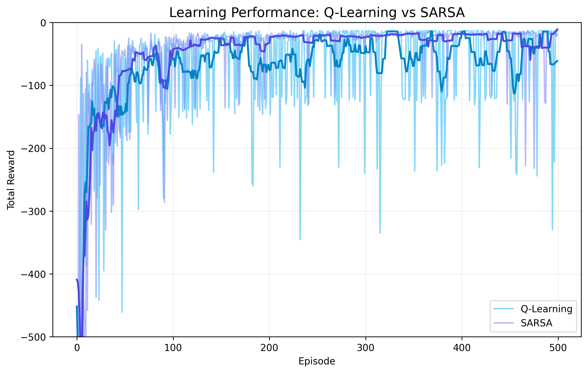
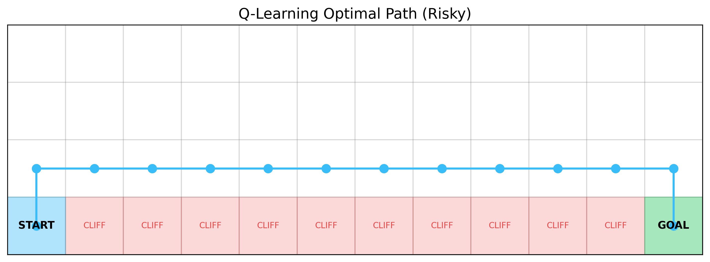
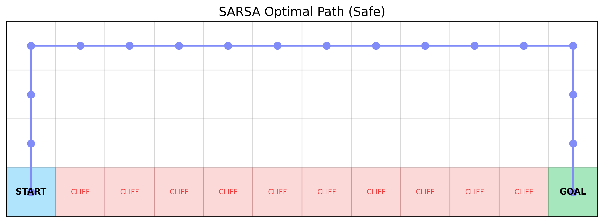

# DRL HW2: Cliff Walking - Q-Learning vs. SARSA

[](https://github.com/g114093002/DRL_HW2)
[](https://opensource.org/licenses/MIT)

本專案實作並深入比較了兩種經典的強化學習演算法：**Q-Learning** (Off-policy) 與 **SARSA** (On-policy)，並以經典的 **Cliff Walking** 網格環境作為實驗場景。

## 📍 環境描述
- **地圖大小**: 4x12
- **獎勵機制**:
  - 每走一步: -1
  - 掉入懸崖: -100 (並回到起點)
  - 到達終點: 回合結束
- **參數設定**:
  - $\epsilon = 0.1$
  - $\alpha = 0.1$
  - $\gamma = 0.9$
  - 訓練回合: 500 次

## 📈 學習表現與收斂分析



### 比較討論
| 特性 | Q-Learning | SARSA |
| :--- | :--- | :--- |
| **類型** | Off-policy (離策略) | On-policy (同策略) |
| **收斂穩定性** | 較低，訓練中頻繁掉入懸崖 | 較高，整體回報較平穩 |
| **策略偏向** | **冒險型**。追求理論最優路徑。 | **保守型**。追求實際運行中的安全性。 |
| **線上表現** | 較差 (因為會一直嘗試踩邊緣) | 較佳 (會與邊緣保持安全距離) |

## 🗺️ 最終策略路徑視覺化

### Q-Learning 最優路徑 (RISKY)

*Q-Learning 學習到了緊貼懸崖的最短路徑。由於它在更新時假設未來會採取最優行動 ($max Q$)，因此它忽略了隨機探索 ($\epsilon$) 可能導致掉入懸崖的風險。*

### SARSA 最優路徑 (SAFE)

*SARSA 選擇向上繞道。因為 SARSA 是同策略演算法，它在學習時會考慮到實際執行的 $\epsilon$-greedy 策略。如果走在懸崖邊緣，即使最優行動是向右，探索行為仍有 10% 的機率向下踩空，因此 SARSA 選擇了一條更穩健的路徑。*

## 🚀 如何運行
1. 安裝依賴:
   ```bash
   pip install numpy matplotlib
   ```
2. 執行訓練與繪圖:
   ```bash
   python simulator.py
   python generate_plots.py
   ```
3. 查看即時數據儀表板 (選用):
   - 直接打開 `dashboard/index.html`

## 五、理論比較與討論
在本實驗中，我們深入探討了以下核心概念：

- **Q-learning 為離策略（Off-policy）方法**：其更新基於「下一狀態的最佳可能行動」($\max_{a} Q(s', a)$)，即使該行動在目前探索策略下未實際執行。這使得 Q-learning 目標明確地指向理論上的最優解。
- **SARSA 為同策略（On-policy）方法**：其更新基於「實際採取的行動」($Q(s', a')$)。它在學習過程中會反映出當前探索策略（如 $\epsilon$-greedy）的影響。

**一般而言：**
- **Q-learning** 傾向學習到理論上的最優策略，但在訓練過程中，由於其不考慮探索帶來的風險，行為通常較具風險。
- **SARSA** 則會考量到探索行為（如隨機踩空）帶來的懲罰，因此傾向學習在實際探索策略下較安全、穩定的行為。

## 六、結論
總結兩種方法在本實驗中的差異：

1. **哪一種方法收斂較快？**
   - **Q-learning** 在尋找「理論最短路徑」上收斂較快，因為它直接鎖定目標最優值。然而，在收斂過程中，其累積獎勵（Total Reward）的波動與懲罰遠高於 SARSA。
2. **哪一種方法較穩定？**
   - **SARSA** 在訓練過程中顯著較穩定。由於它學會了與懸崖保持距離，在存在 $\epsilon$ 探索噪聲的情況下，它避免了頻繁觸發 -100 懲罰的慘況。
3. **在何種情境下應選擇 Q-learning 或 SARSA？**
   - **選擇 Q-learning**：當模擬環境與實際執行環境完全一致，且我們只在乎最終學出的策略是否達到理論極限（如：純數位賽局、棋類）。
   - **選擇 SARSA**：當「學習過程中的安全性」至關重要，或者環境噪音較大、代價高昂時（如：實體自動駕駛、機器人控制），SARSA 能提供更安全的學習歷程。

---
Created by Antigravity for DRL HW2.
